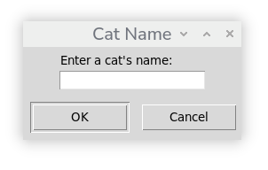

# Cats Manager

A simple Python desktop application built with Tkinter as part of my software development learning journey
The application allows users to search for cats, add new cats to a list, and automatically save changes so they're available the next time the program is opened.

## Screenshot

## Features

- Search for a cat by name
- Check whether a cat exists in the list
- Add new cats through a GUI
- Save new cats permanently to a text file
- Display the complete list of cats in a GUI window
- Uses pop-up dialogs instead of the termina

## Technologies Used
- Python
- Tkinter
- Text files
- Git and GitHub

## Concepts Practised

- Lists
- Conditional logic
- Loops
- File handling
- List comprehensions
- String methods
- Functions and methods
- GUI and Tkinter

## Future Improvements

- Prevent duplicate cat names
- Delete cats from the list
- Edit existing cat names
- Sort alphabetically
- Add search suggestions
- Store additional information such as age and breed
- Replace the text file with a database (SQLite)

## Author

Ian Buchanan
